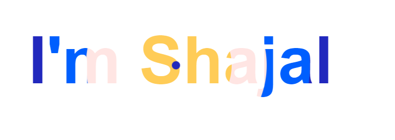

# GSAP Animation Practice

This repo is the part of my frot-end development journey. In modern web app we can see there are using so many web animation. So i practice GSAP for web animation. GSAP is really a very awesome and simple but very powerfull animation libray.

## Demo

https://shajal-kumer.github.io/gsap-animation/

## Lessons Learned

I have learned GSAP different API.

-   Basic

    -   x (translateX)
    -   y (translateY)
    -   duration
    -   delay
    -   paused
    -   stagger
    -   repeat
    -   repeatDelay
    -   yoyo
    -   yoyoEase
    -   yoyoEase
    -   ease
    -   onComplete()
    -   onUpdate()
    -   onStart()

-   Tweens

    -   to()
    -   from()
    -   fromTo()
    -   set()

-   Timelines

    -   sequence mutilple tweens
    -   position parameter (controls placement)

-   Control methods

    -   play()
    -   pause()
    -   resume()
    -   reverse()
    -   restart()
    -   timeScale()
    -   seek()
    -   progress()]

-   Eases

    -   Different type of ease funtion

-   ScrollTrigger

    -   trigger
    -   start
    -   end
    -   scrub
    -   pin
    -   markers
    -   toggleActions
    -   toggleClass

## Screenshots

> Car ride animation

> Text hover animation

## Tech Stack

**Client:** HTML, CSS, Javascript, GSAP

## 🚀 About Me

I'm a front-end developer

## 🛠 Skills

Javascript, React, HTML, CSS, Bootstrap, Tailwind, SASS, SVG, GSAP

## Acknowledgements

-   [GSAP Animation Tutorial | Create Awesome Animations With Javascript](https://www.youtube.com/watch?v=5RyrIPCs47A&t=2s)
-   [Lean GSAP in 30 Minutes](https://www.youtube.com/watch?v=m6PDUIF24v4)
-   [Magical GSAP Text Hover Animation Tutorial // Landing Page](https://www.youtube.com/watch?v=a3-lwxTkUKI)
-   [GSAP (Green Sock Animation Platform) Web SVG Animation Tutorial](https://www.youtube.com/watch?v=2wSzfr49yhk)
